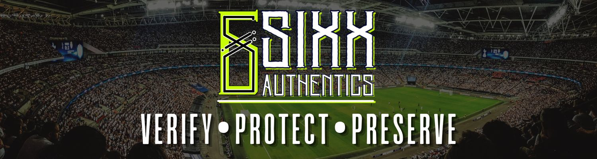

  

  

<h1 align="center">Sixx Authentics Grading Standards</h1>

  <strong>Verify • Protect • Preserve</strong>

  
  
  

---

## Overview

Sixx Authentics grades trading cards with a focus on consistency, transparency, and collector trust.

Our grading system is built around two parts:

- **Condition Grade** — physical quality only.
- **Market Context Score** — collectability, rarity, originality, significance, and provenance.

This separation keeps the grading process clear, repeatable, and easy to understand.

---

## Condition Grade

The Condition Grade measures the card’s physical quality on a **0.0–10.0** scale.

### What we evaluate
- Front condition.
- Back condition.
- Corners.
- Edges.
- Visual appearance.
- Autograph status.
- Provenance.

### Condition bands
- **10.0** — Pristine.
- **9.0–9.9** — Excellent.
- **8.0–8.9** — Strong with minor flaws.
- **7.0–7.9** — Clearly worn.
- **Below 7.0** — Significant wear or damage.

---

## Market Context Score

The Market Context Score measures how special a card is beyond its physical condition.

### What we evaluate
- Scarcity.
- Originality.
- Historical significance.
- Demand.
- Provenance strength.
- Availability of comps.

### Market bands
- **M0** — Common, no premium.
- **M1** — Minor premium.
- **M2** — Moderate premium.
- **M3** — Strong premium.
- **M4** — Very strong premium.
- **M5** — Exceptional premium.

---

## How to read a label

Example:

**9.25 / M3**

- The first number is the physical Condition Grade.
- The M score is the Market Context Score.
- Together, they describe the card’s quality and collectible position.

---

## Why this matters

A card can be beautiful but common.
A card can be rare but heavily worn.

By separating condition from market context, Sixx Authentics gives both sides of the story without mixing appearance and value into one unclear grade.

---

## Grading philosophy

Our grading process is designed to:
- Stay consistent across all card types.
- Reward accuracy over guesswork.
- Treat rare and historically important cards fairly.
- Document uncertainty instead of hiding it.

If two possible grades are close, the lower grade is chosen unless there is clear documented justification to move up.

---

## Brand note

  <strong>Sixx Authentics</strong> 
  Verify • Protect • Preserve

  Grading with consistency, clarity, and collector trust.

